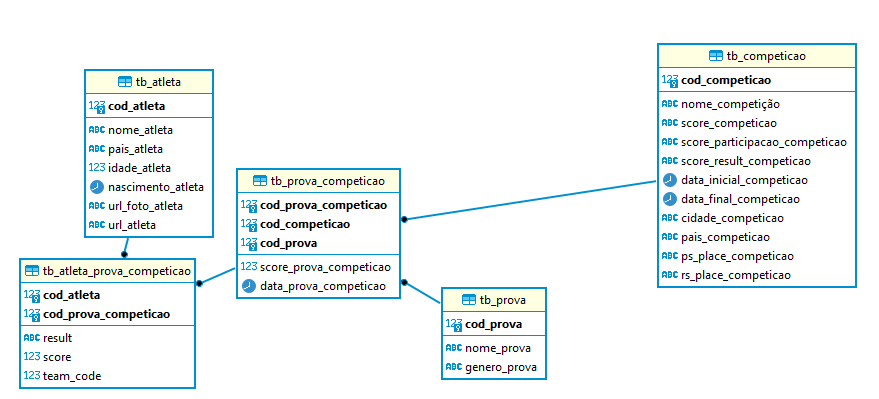

# DATA VISUALIZATION ABOUT 100 METERS OFFICIAL COMPETITIONS 

### OBJECTIVES

The objetive of this project was build a data base throught web scrapping  on site https://worldathletics.org/ .   The following data base was created 

## STUDY

Using the api from visual crossing on https://www.visualcrossing.com/weather-api we could relate all results from competitions and weather conditions 

## INSIGHTS FROM STUDY 

Based on rules of athletism organization no records can be register above 1000 altitude and above 2m/s for wind speed. 

So, in 1968 when the first man ran below 10 sec, today it wouldn´t consider a record for 100 meters. 

Bolt said, after broke 9,69 sec,  "let me run in mexico city and I can get 9,45 sec" 

So, we know that the climate conditions affect results as biologic conditions, out of this study, Usain bolt can have some difference from others? 

## OUTPUTS

https://public.tableau.com/app/profile/andre.marcelo.da.cruz.nunes/viz/Livro1_16454034118450/100meters

https://www.kaggle.com/andremarcelonunes/100meters

